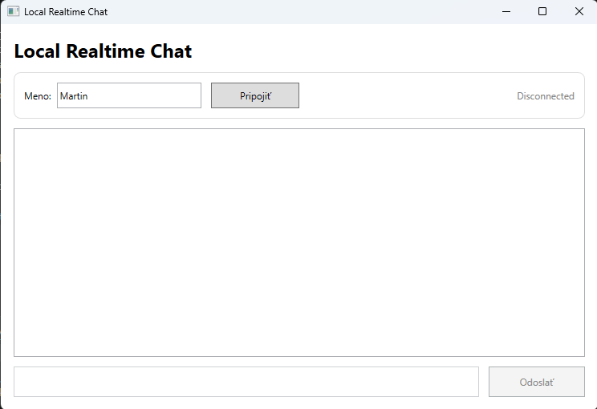
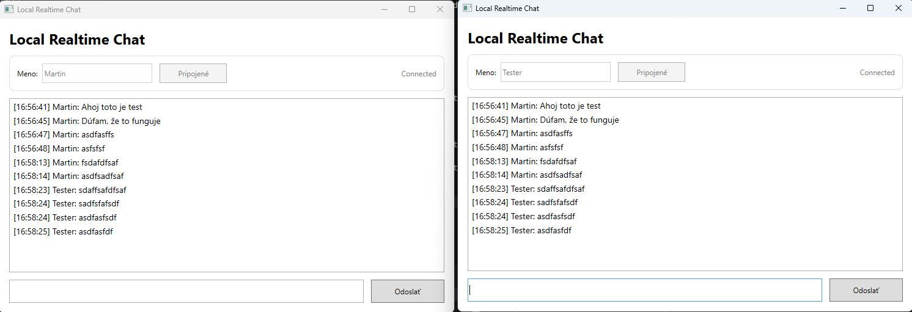
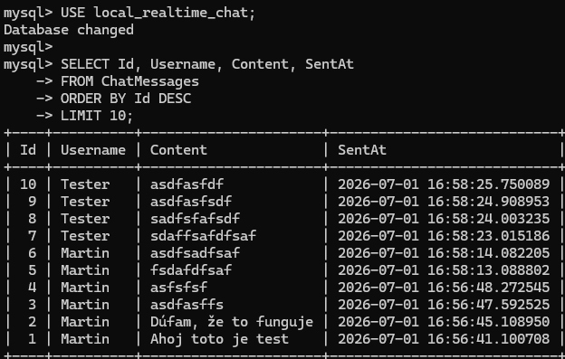

# LocalRealtimeChat

LocalRealtimeChat je jednoduchá lokálna chatovacia aplikácia v reálnom čase vytvorená ako technické zadanie.

Riešenie obsahuje:

* desktopovú aplikáciu WPF
* backend API postavené na ASP.NET Core
* natívnu komunikáciu cez WebSocket
* databázu MySQL
* Entity Framework Core pre prístup k databáze

Aplikácia beží lokálne. Viacerí WPF klienti sa môžu pripojiť k backendu a komunikovať medzi sebou v reálnom čase.

## Technológie

* C#
* .NET
* WPF
* ASP.NET Core
* WebSocket
* MySQL
* Entity Framework Core
* Pomelo EntityFrameworkCore MySQL provider

## Funkcionalita

* pripojenie na lokálny WebSocket server
* odosielanie správ v reálnom čase
* okamžité prijímanie správ vo všetkých pripojených klientoch
* ukladanie správ do MySQL databázy
* načítanie histórie správ po pripojení
* jednoduché používateľské rozhranie vo WPF
* lokálne vývojové prostredie

## Screenshoty

### Hlavné okno aplikácie



### Komunikácia medzi dvomi klientmi



### Uložené správy v databáze



## Štruktúra projektu

```text
LocalRealtimeChat/
│
├── LocalRealtimeChat.Api/
│   ├── Data/
│   │   ├── AppDbContext.cs
│   │   └── AppDbContextFactory.cs
│   ├── Models/
│   │   ├── ChatMessage.cs
│   │   ├── ChatMessageDto.cs
│   │   ├── WebSocketEnvelope.cs
│   │   └── WebSocketMessageTypes.cs
│   ├── WebSockets/
│   │   └── ChatWebSocketHandler.cs
│   ├── Migrations/
│   ├── Program.cs
│   └── appsettings.json
│
├── LocalRealtimeChat.Wpf/
│   ├── Models/
│   │   └── ChatMessageDto.cs
│   ├── Services/
│   │   └── WebSocketChatClient.cs
│   ├── MainWindow.xaml
│   └── MainWindow.xaml.cs
│
├── docs/
│   └── screenshots/
│       ├── base-chat-window.png
│       ├── base-two-clients.png
│       └── base-database.png
│
├── LocalRealtimeChat.sln
├── .gitignore
└── README.md
```

## Nastavenie databázy

Vytvor MySQL databázu a používateľa:

```sql
CREATE DATABASE local_realtime_chat
CHARACTER SET utf8mb4
COLLATE utf8mb4_unicode_ci;

CREATE USER 'chatapp'@'localhost' IDENTIFIED BY 'chatapp123';

GRANT ALL PRIVILEGES ON local_realtime_chat.* TO 'chatapp'@'localhost';

FLUSH PRIVILEGES;
```

Connection string sa nachádza v:

```text
LocalRealtimeChat.Api/appsettings.json
```

Predvolený connection string:

```json
"server=localhost;port=3306;database=local_realtime_chat;user=chatapp;password=chatapp123"
```

Ide o lokálnu demo konfiguráciu pre účely zadania.

## Aplikovanie databázovej migrácie

Z koreňového priečinka spusti:

```cmd
dotnet ef database update --project LocalRealtimeChat.Api --startup-project LocalRealtimeChat.Api
```

## Spustenie backendu

Z koreňového priečinka spusti:

```cmd
dotnet run --project LocalRealtimeChat.Api
```

Predvolená URL backendu:

```text
http://localhost:5065
```

WebSocket endpoint:

```text
ws://localhost:5065/ws/chat
```

## Spustenie WPF klienta

Otvor ďalší terminál a spusti:

```cmd
dotnet run --project LocalRealtimeChat.Wpf
```

Pre otestovanie komunikácie v reálnom čase spusti klienta dvakrát v dvoch samostatných termináloch.

Príklad:

```cmd
dotnet run --project LocalRealtimeChat.Wpf
dotnet run --project LocalRealtimeChat.Wpf
```

Použi rôzne používateľské mená v oboch oknách a posielaj správy medzi nimi.

## Ako to funguje

1. WPF klient sa pripojí k backendu cez WebSocket.
2. Backend uchováva pripojených klientov v pamäti.
3. Po prijatí správy ju backend uloží do MySQL databázy.
4. Uložená správa sa odošle všetkým pripojeným klientom.
5. Pri pripojení nového klienta backend odošle históriu správ z databázy cez WebSocket.

## Poznámky

Tento projekt zámerne používa natívnu WebSocket komunikáciu namiesto SignalR.

Cieľom je udržať komunikáciu v reálnom čase jednoduchú, transparentnú a ľahkú pre lokálne technické zadanie.

REST polling sa na chatové správy nepoužíva.
